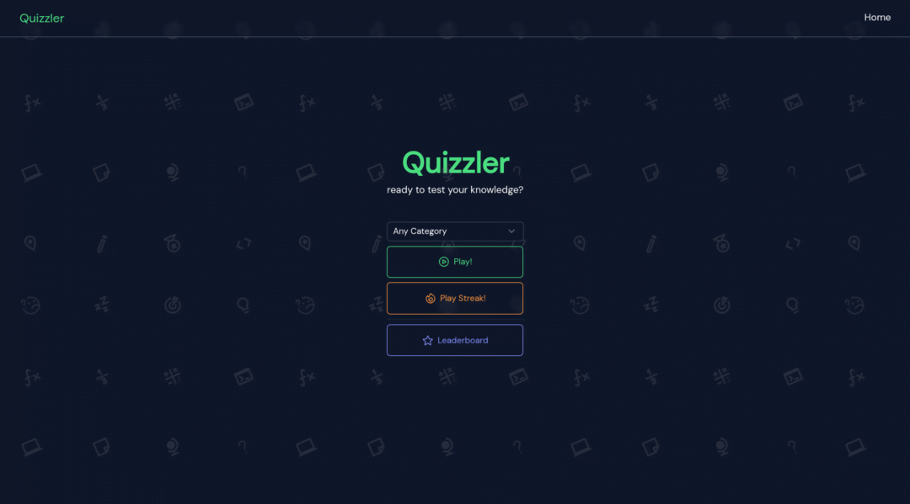

<h1 align="center">Quizzler - Quiz app</h1>

<p align="center">
  
</p>

<p align="center">
    Quizzler is a simple and fun quiz game that challenges you with different categories and lets you compete for the leaderboard for all the correct answers! Built with Nuxt 3 and its ecosystem.
</p>

## App & Preview

Play : [Quizzler](https://quizzler.jooo.my.id/)

<p align="center">
  
</p>

## Library, Frameworks & Tools Used

- [Nuxt 3](https://nuxt.com/)
  - [Nuxt UI](https://ui.nuxt.com/)
  - [Nuxt Google Fonts](https://google-fonts.nuxtjs.org/)
  - [Nuxt SEO](https://nuxtseo.com/)
- [Supabase](https://supabase.com/)
  - [Nuxt Supabase](https://supabase.nuxtjs.org/)
- [Pinia](https://pinia.vuejs.org/)
- [TailwindCSS](https://tailwindcss.com/)
- [Open Trivia Database](https://opentdb.com/) (The quiz API)
- [Bun](https://bun.sh/)

## Setup & Build

if you want to continue or modify this project, you can follow these steps:

- Clone this project

```bash
git clone https://github.com/jo0707/quizzler
```

- Install dependencies (bun)

```bash
bun install
```

This project uses Supabase as its leaderboard database:

- Create a Supabase account
- Create a new project
- Create a leaderboard table, you can use this SQL query:

```sql
create table
  public.leaderboard (
    id bigint generated by default as identity,
    created_at timestamp with time zone not null default now(),
    name character varying null,
    score integer not null default 0,
    time integer not null default 0,
    mode character varying not null default ''::character varying,
    constraint leaderboard_pkey primary key (id)
  ) tablespace pg_default;
```

- Go to the leaderboard table, You can either disable the RLS, or create a new RLS that allows public to do INSERT and SELECT query.

- Copy your project URL and public key from the project settings tab

- Create new .env file and fill it with your Supabase credentials

```env
SUPABASE_URL=https://yourproject.supabase.co"
SUPABASE_KEY="your.anon.token"
```

- Run the project

```bash
bun dev
```

- Build the project

```bash
bun run build
#or
bun run generate # static hosting
```

## Contributing

Made by [jo0707](https://github.com/jo0707)

Feel free to contribute to this repository!
